## Problem Statement

Porter, India's largest marketplace for intra-city logistics, is revolutionizing the delivery sector with technology-driven solutions. Analyzing this dataset can provide significant insights into delivery dynamics, efficiency bottlenecks, and optimization opportunities. The insights obtained can enhance Porter's operational efficiency, ensuring timely deliveries and improving driver-partner allocation.

***Data***

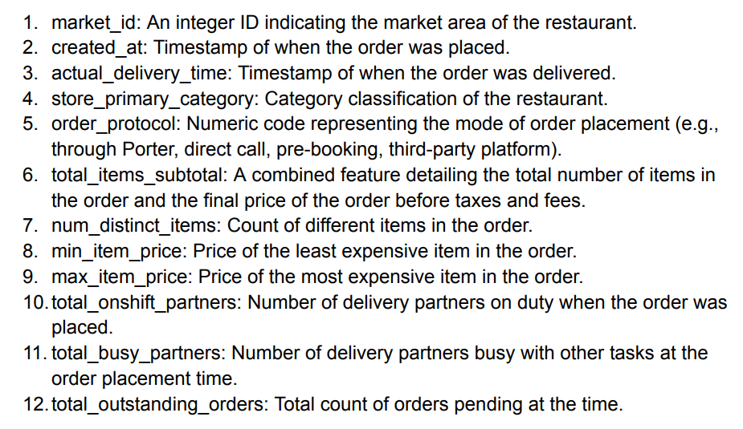 

This dataset is about each order placed from different restaurants located in different areas and our goal is to predict delivery time of these orders. Data has 1,97,428 rows where each row represents an order.

***Problem Statement - Decoded***

1. Providing precise delivery estimates - Improves customer satisfaction and reduces churn
2. Proper allocation of delivery partners - Optimised operational costs
3. Identifying bottlenecks - Reducing higher delivery times

## EDA

***Uni-variate Analysis***

 

* Around 50% of the restaurants are located in area: 2.0 or 4.0
* Around 75% of the orders are paid through modes: 1.0, 3.0, 5.0 whereas 6.0 & 7.0 are almost negligible

***Restaurant categories***

 

* Above chart shows what type of restaurants people mostly order from
* American, Pizza & mexican are the most popular type of restaurants

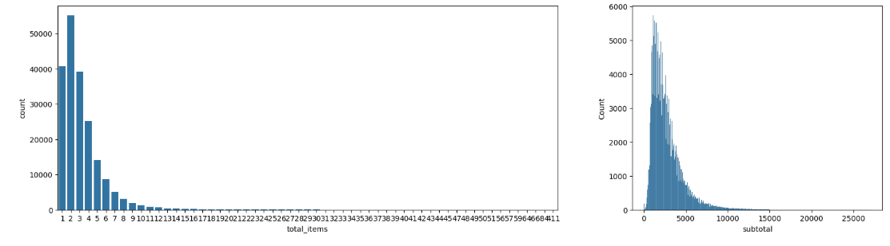 

* Most of the orders have total no. of items <= 5
* Most of the orders have sub total between < 5000
* Distribution is slightly skewed towards right, maybe because of large corporate or party orders

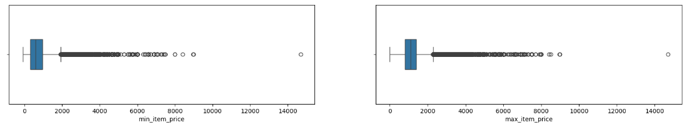 

* Average min value of item < 1000 whereas average max value per item > 1000
* Values range between 0 & 14,000, maybe there could be some outliers since some values are very high and isolated

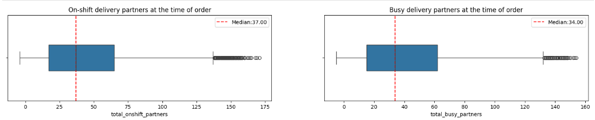 

* Median value at the time of order: on-shift delivery partners - 37, busy delivery partners - 34

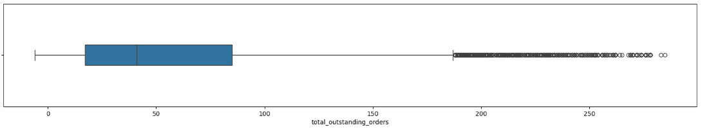 

* Average total outstanding orders = 58

***Extracting Time & Day of the week***

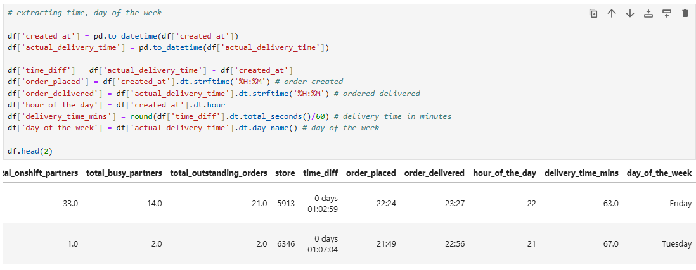
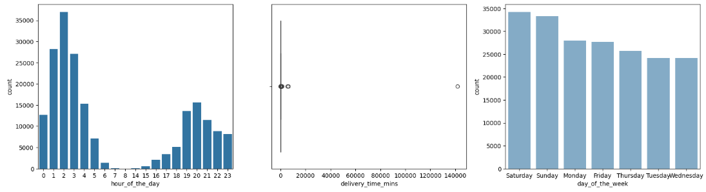 

* Peak time is from 1am to 3 am & 7pm to 9 pm
* No. of orders at 2am is double of no. of orders at 8pm
* Average delivery time is around 48 mins whereas median delivery time is 44 mins
* Max delivery time is around 1,41,948 mins which is clearly an outlier
* No. of orders are higher during weekends i.e. saturday & sunday compared to weekdays

***Bi-variate Analysis***

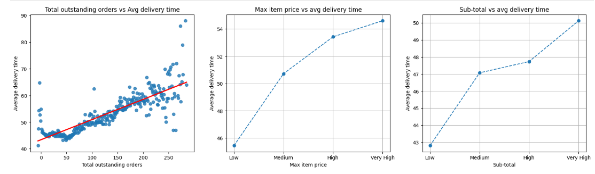

* Average delivery time is increasing with increase in total outstanding orders
* Average delivery time remains constant till total outstanding orders reach 50 and then increase linearly with total outstanding orders
* As total outstanding orders cross 200, delivery time is increasing non-linearly
* Average delivery time increases linearly with max item price & sub - total

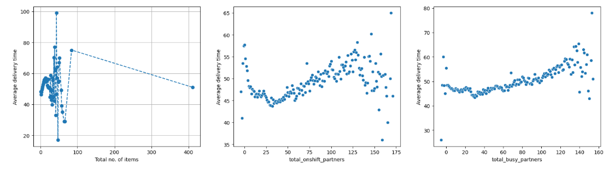

* Average delivery time is fluctuating as total no. of items are increasing
* Initially, as no. of total on-shift/busy delivery partners increases till 30, average delivery time decreases
* As no. of on-shift/busy delivery partners crosses 30, average delivery time increases

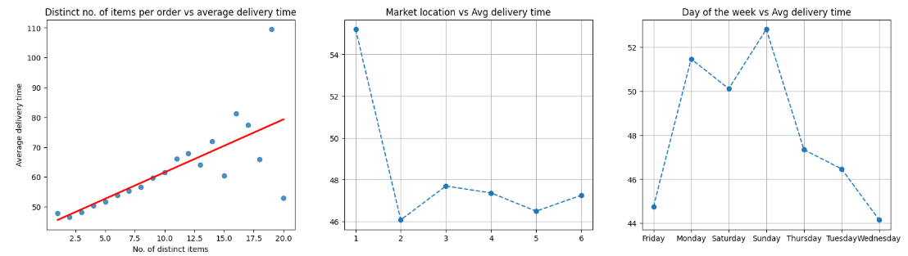 

* Average delivery time increases linearly as no. of disntict items increases
* Average delivery for market id 1 is around 54 mins whereas for rest of the market ids, average delivery time is around 46 mins
* Avg delivery time is highest during: sunday > monday > saturday > thursday > tuesday > friday > wednesday

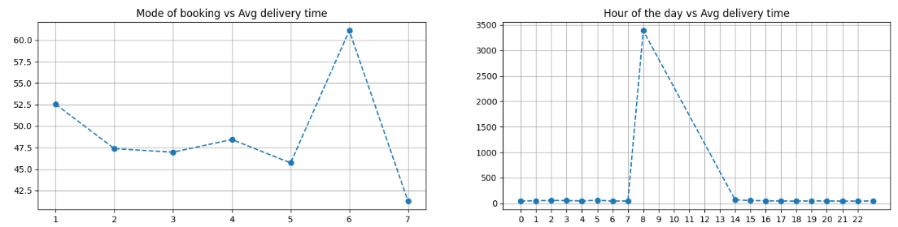

* Average delivery time decreases from 52 to 41 as we move from 1 to 7, but only for 6, it increases to 60
* Unusual spike in average delivery time at 8am

## Data Pre-Processing

* 16,262 rows have missing values in on-shift partners, busy partners & outstanding orders together, which forms 8% of total data
* Significant correlation for on-shift partners, busy partners & outstanding orders is with each other and with:
* hour of the day

Assumptions:        

Since values have variance at each hour, assuming they follow normal distribution, imputation will be done using mean & std for individual feature
