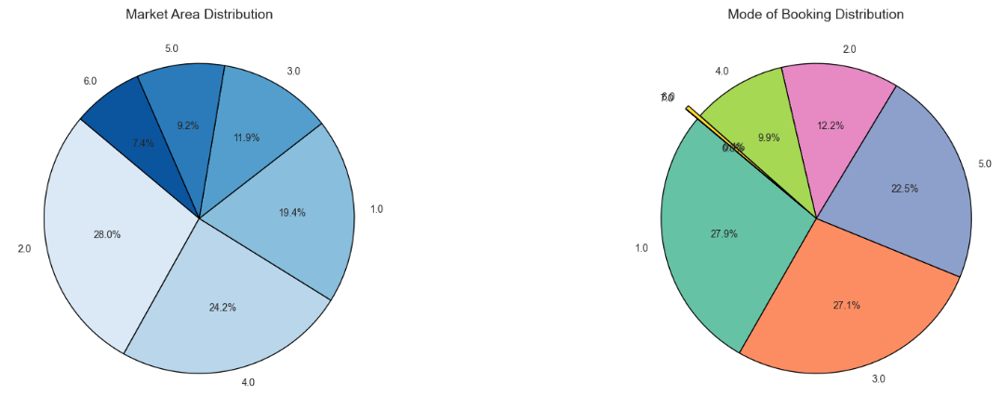
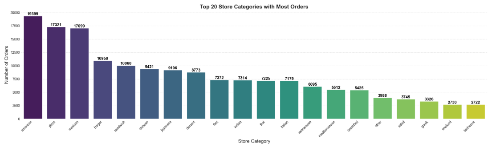
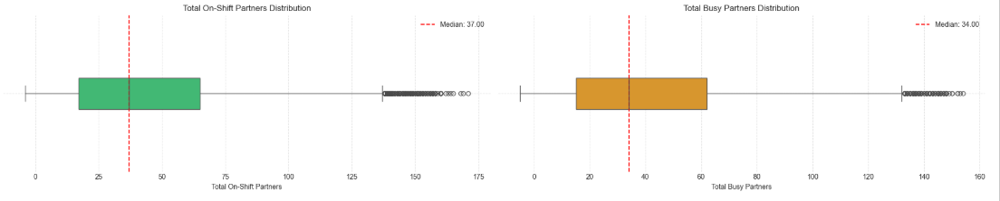
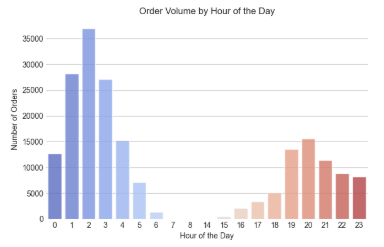
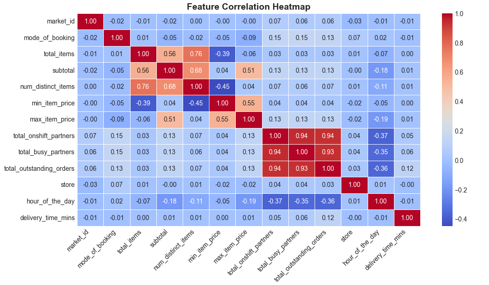

## Problem Statement

India’s largest intra-city logistics marketplace, aims to revolutionize delivery services by leveraging technology to provide accurate delivery time estimates, a key driver of customer satisfaction. This project focuses on predicting delivery times using a dataset of order and delivery details, including market areas, restaurant categories, order volumes, and partner availability.

1. To develop a predictive model that delivers ***precise delivery time estimates, reducing customer churn and improving satisfaction***
2. To optimize the ***allocation of delivery partners*** by understanding demand patterns and operational capacity
3. To identify bottlenecks causing delays, enabling ***operational efficiency gains***

By employing exploratory data analysis, feature engineering, and machine learning models ***(Random Forest, XGBoost, and Neural Networks)***, this analysis seeks to provide actionable insights that enhance company's ability to ensure timely deliveries and streamline logistics operations

**Data**

 

This dataset is about each order placed from different restaurants located in different areas and our goal is to predict delivery time of these orders. Data has 1,97,428 rows where each row represents an order

**Assumptions:**

* Since the number of on-shift partners is less than the number of busy partners, I assume that on-shift partners represent the available delivery partners at the time of the order, while busy partners refer to those who are currently offline
* The metrics for delivery partners and outstanding orders are indicative at the platform level rather than being specific to individual markets

## Project Contents

1. EDA
2. Data Pre-Processing
3. Model Training & Evaluation
4. Key Insights & Business Impact

## EDA

**Market & Payment Distributions:**

- ~70% of restaurants are in market areas 1.0, 2.0, and 4.0
- Approximately 75% of orders use payment modes 1.0, 3.0, and 5.0

**Restaurant Categories & Order Composition:**

- Top cuisines include American, Pizza, and Mexican
- Most orders consist of 5 or fewer items, with a few large, high-value orders

  
**Price & Partner Metrics:**

- Item price distributions reveal low minimum prices with some high-end outliers
- Median on-shift partners (available) are 37, while busy (offline) partners are 34, showing fluctuations in workforce availability

**Delivery Time Trends:**

- Average delivery time is ~48 minutes (median 44 minutes)
- Peak order volumes occur early in the morning and in the evening, with weekends showing higher demand

**Correlation Insights:**

- Strong positive correlation exists between total items and subtotal, and between partner metrics
- Delivery time is weakly correlated with most features, implying that external factors (e.g., traffic, weather) likely play a role

